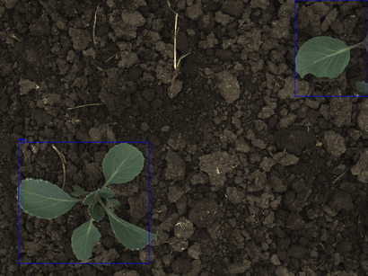

# Cabbage tracker

Python tool for real-time detection and mapping of young cabbage plants.
## Features
* TODO
## Visualization
Below is a sample animation of the detection:

## Quick Start
1. ...
2. ...